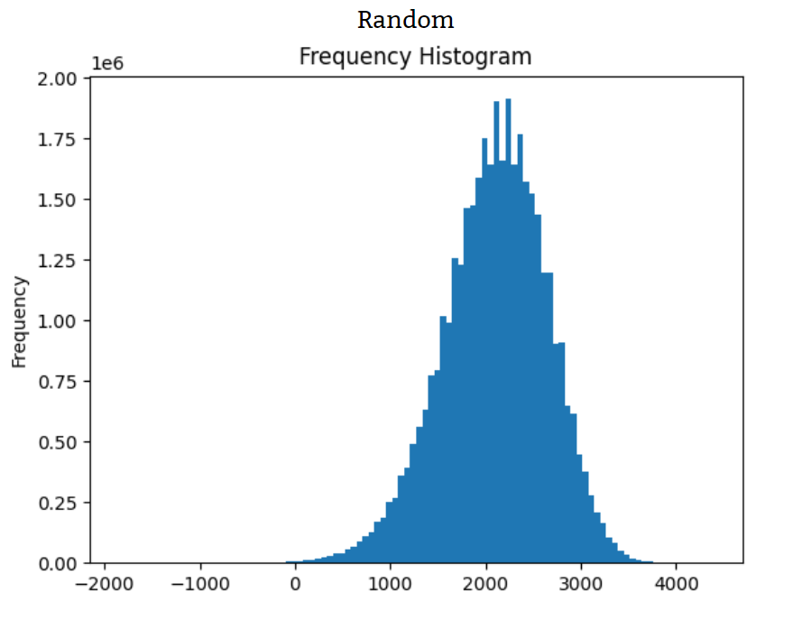

# Algorithms

## Baseline

As the goal is to maximise the K in K = p\*10000 - (T\*100 + Min), we have written three algorithms as a baseline to gain an insight into the state-space:

1. A *Random* algorithm that randomly chooses a starting station and randomly extends route till time frame has been hit. This process is repeated till the maximum number of routes has been reached.
2. A *Greedy* algorithm that always picks the station with the least amount of uncovered connections as a starting station. After, it will keep picking the shortest uncovered connection till the time frame is hit. This process is repeated till the maximum number of routes has been reached.
3. A combination of Random and Greedy called *RandomGreedy*. This algorithm will randomly choose a starting station. After, it will randomly pick a uncovered connection. This process is repeated till the maximum number of routes is hit.

The Random and RandomGreedy algorithms were run millions of iterations for the National problem (max routes = 20, time frame = 180 mins).

### Results

  
  

These two results show the scores that are easy to achieve with the use of simple algorithms like Random and RandomGreedy.

## First Algorithm

For the first algorithm we have written a *Depth-first search* with several types of pruning to enhance the optimalisation.
With Depth-first search a random root station is picked and explores routes as far as possible, before it starts backtracking to look for better solutions.
The algorithm is adjusted as to suit with the constraints given for the case:
- The algorithm will not allow more routes than the given maximum.
- Routes may not exceed the given time frame.

The different types of pruning we have added are:

1. Follows the formula K = 10000 * p - (T * 100 + min). P is calculated as (current route / max routes) to make sure a certain amount of stations are covered per route.
2. Makes sure first routes start with stations with one connection until all have been used.
3. Routes never retake a connection in the same direction.
4. Routes never retake the last connection.
5. Pruned when the total connections driven exceed the total covered connections multiplied by a variable: driven connections > covered connections * a
6. Favours stations that only have one unused connection left.
7. Favours connections that haven't been used yet.

The Depth-first search was run thousands of iterations for the National problem (max routes = 20, time frame = 180 mins).

### Results

  

These scores are noticeably better than the ones of Random and RandomGreedy, but there remains a shortage of high scores (>7100).

## Second Algorithm

The second algorithm we have written is a *Simulated Annealing* algorithm.
Simulated Annealing runs on an already created solution and is an effective approach of finding global maxima.
Our version of Simulated Annealing uses a *HillClimber* algorithm as a foundation.
This HillClimber has a few random mutation options:

- The first or last connection of a random route is removed.
- The first or last connection of a random route is replaced with a random eligible connection.
- A random route is randomly extended.
- A random route is removed in its entirety if the best score has not been improved after a certain amount of iterations.
- A random route is made if the best score has not been improved after a certain amount of iterations.

Our aim of these mutations was to try to eliminate unnecessary overlap as much as possible and only occur if it ultimately raises the score.

We ran Simulated Annealing on multiple results of each base state for National problem (max routes = 20, time frame = 180 mins):

- Random (200k Simulated Annealing iterations, temperature = 100)
- RandomGreedy (1M Simulated Annealing iterations, temperature = 100)
- Depth-first (1M Simulated Annealing iterations, temperature = 100)

### Results

  
  
  

Simulated Annealing performed the best out of all our algorithms. The results show that it raises every score to at least the high 6000s and often higher than 7000. It seems like the better the base state is, the greater the potential is for Simulated Annealing to achieve a high score (>7100). Our ultimate best score of 7311.64 was achieved with Depth-first as base state and can be found in the results folder.
